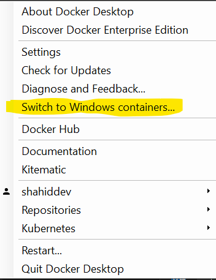
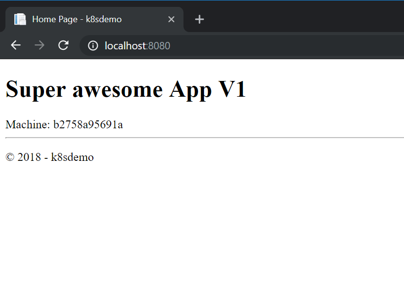

# Docker Basics

## Introduction

This section introduces some basic docker concepts and commands.
By the end of this section you should be able to pull images, run them and access web applications.

## Exploring Docker command line

Before you start ensure your Docker for Windows is set to Linux containers. Right-click the Moby icon in the system tray, the menu option should read "Switch to Windows containers" which indicates you are already set to Linux containers (the default when you first install the tooling).



## Explore Docker commands

Like many Command Line Interfaces (CLIs) the Docker CLI typically has subcommands which can be used to action specific commands.
In most cases you can always invoke the subcommand with --help to get help specific to that subcommand.

Let's start by checking the version of Docker tooling we've got installed.

```txt
docker version
```

We should see something similar to:

```txt
Client: Docker Engine - Community
 Version:           18.09.2
 API version:       1.39
 Go version:        go1.10.8
 Git commit:        6247962
 Built:             Sun Feb 10 04:12:31 2019
 OS/Arch:           windows/amd64
 Experimental:      false

Server: Docker Engine - Community
 Engine:
  Version:          18.09.2
  API version:      1.39 (minimum version 1.12)
  Go version:       go1.10.6
  Git commit:       6247962
  Built:            Sun Feb 10 04:13:06 2019
  OS/Arch:          linux/amd64
  Experimental:     false
```

We can also use this command to confirm we are running in Linux container mode by inspecting the OS/Arch line in the Server section.

We can list the docker commands available:

```txt
docker
```

We can see the available commands:

```txt
Usage:  docker [OPTIONS] COMMAND

A self-sufficient runtime for containers

Options:
      --config string      Location of client config files (default
                           "C:\\Users\\Shahid\\.docker")
  -D, --debug              Enable debug mode
  -H, --host list          Daemon socket(s) to connect to
  -l, --log-level string   Set the logging level
                           ("debug"|"info"|"warn"|"error"|"fatal")
                           (default "info")
      --tls                Use TLS; implied by --tlsverify
      --tlscacert string   Trust certs signed only by this CA (default
                           "C:\\Users\\Shahid\\.docker\\ca.pem")
      --tlscert string     Path to TLS certificate file (default
                           "C:\\Users\\Shahid\\.docker\\cert.pem")
      --tlskey string      Path to TLS key file (default
                           "C:\\Users\\Shahid\\.docker\\key.pem")
      --tlsverify          Use TLS and verify the remote
  -v, --version            Print version information and quit

Management Commands:
  builder     Manage builds
  config      Manage Docker configs
  container   Manage containers
  image       Manage images
  network     Manage networks
  node        Manage Swarm nodes
  plugin      Manage plugins
  secret      Manage Docker secrets
  service     Manage services
  stack       Manage Docker stacks
  swarm       Manage Swarm
  system      Manage Docker
  trust       Manage trust on Docker images
  volume      Manage volumes

Commands:
  attach      Attach local standard input, output, and error streams to a running container
  build       Build an image from a Dockerfile
  commit      Create a new image from a container's changes
  cp          Copy files/folders between a container and the local filesystem
  create      Create a new container
  diff        Inspect changes to files or directories on a container's filesystem
  events      Get real time events from the server
  exec        Run a command in a running container
  export      Export a container's filesystem as a tar archive
  history     Show the history of an image
  images      List images
  import      Import the contents from a tarball to create a filesystem image
  info        Display system-wide information
  inspect     Return low-level information on Docker objects
  kill        Kill one or more running containers
  load        Load an image from a tar archive or STDIN
  login       Log in to a Docker registry
  logout      Log out from a Docker registry
  logs        Fetch the logs of a container
  pause       Pause all processes within one or more containers
  port        List port mappings or a specific mapping for the container
  ps          List containers
  pull        Pull an image or a repository from a registry
  push        Push an image or a repository to a registry
  rename      Rename a container
  restart     Restart one or more containers
  rm          Remove one or more containers
  rmi         Remove one or more images
  run         Run a command in a new container
  save        Save one or more images to a tar archive (streamed to STDOUT by default)
  search      Search the Docker Hub for images
  start       Start one or more stopped containers
  stats       Display a live stream of container(s) resource usage statistics
  stop        Stop one or more running containers
  tag         Create a tag TARGET_IMAGE that refers to SOURCE_IMAGE
  top         Display the running processes of a container
  unpause     Unpause all processes within one or more containers
  update      Update configuration of one or more containers
  version     Show the Docker version information
  wait        Block until one or more containers stop, then print their exit codes

Run 'docker COMMAND --help' for more information on a command.
```

We can list any images we have downloaded:

```txt
docker images
```

If you have a clean docker install you may not see anything listed.

Let's download (pull) an image from the default repository DockerHub

```txt
docker pull microsoft/dotnet-samples
```

Assuming we've not done this recently we should see something similar to this whilst the image is being downloaded. 
The hashes you can see on the left hand side are the layers of the image being downloaded. When you build your own image on top of existing images these layers are re-used saving space and bandwidth

```txt
Using default tag: latest
latest: Pulling from microsoft/dotnet-samples
6ae821421a7d: Downloading [========>                                          ]  3.914MB/22.5MB
8a3a416e6dac: Downloading [====>                                              ]  1.629MB/17.7MB
ed82f21723d8: Downloading [====================>                              ]  1.195MB/2.977MB
eb93c0eccf1b: Waiting
9f1f3a177f08: Waiting
f26df6ad1054: Waiting
```

> Note: we didn't specify a tag so we've pulled the current latest version. In production scenarios you would always specify a tag to ensure you are running a specific version of the image.

Once the image is pulled we can run the docker images command again to see the images pulled locally:

```txt
docker images
```

Now we have this image locally we can run this (we didn't need to pull the image first, the run command will automatically pull the image if required)

```txt
docker run --name hello1 microsoft/dotnet-samples
```

> Note: It's common in most CLIs to have the convention of using a single dash (-) when using single letter flags and using a double dash (--) when using a flag with more than a single letter. 

We should see something like this:

```txt
>docker run --name hello1 microsoft/dotnet-samples
    Hello from .NET Core!
      __________________
                        \
                        \
                            ....
                            ....'
                            ....
                          ..........
                      .............'..'..
                  ................'..'.....
                .......'..........'..'..'....
                ........'..........'..'..'.....
              .'....'..'..........'..'.......'.
              .'..................'...   ......
              .  ......'.........         .....
              .                           ......
              ..    .            ..        ......
            ....       .                 .......
            ......  .......          ............
              ................  ......................
              ........................'................
            ......................'..'......    .......
          .........................'..'.....       .......
      ........    ..'.............'..'....      ..........
    ..'..'...      ...............'.......      ..........
    ...'......     ...... ..........  ......         .......
  ...........   .......              ........        ......
  .......        '...'.'.              '.'.'.'         ....
  .......       .....'..               ..'.....
    ..       ..........               ..'........
            ............               ..............
          .............               '..............
          ...........'..              .'.'............
        ...............              .'.'.............
        .............'..               ..'..'...........
        ...............                 .'..............
        .........                        ..............
          .....


**Environment**
Platform: .NET Core
OS: Linux 4.9.125-linuxkit #1 SMP Fri Sep 7 08:20:28 UTC 2018
```

The --name flag tells Docker to name your running container "hello1", without this flag docker assigns a random (often amusing!) name.

Go ahead and run the same command without the name flag, you should see the same output as above.

```txt
Docker run microsoft/dotnet-samples
```

>Notice how you were able to run multiple instances of the same image, however you wouldn't be able to use the same name twice.

You can see what running containers you have by listing them using:

```txt
Docker ps
```

That's strange where are the containers you just ran?

By default it's up the code running in the container to keep the container "alive". In the case of this sample if there was a Console.ReadLine(); at the end of the code it would have kept the container running.

We can list which containers are running and include those which have recently shutdown by running

```txt
Docker ps -a
```

We can see the container details and how long ago they exited (the details on this command often wrap making them harder to see)

```txt
>docker ps -a
CONTAINER ID        IMAGE                      COMMAND                   CREATED             STATUS                      PORTS                                                                NAMES
f2424d810346        microsoft/dotnet-samples   "dotnet dotnetapp.dll"    7 seconds ago       Exited (0) 4 seconds ago                                                                         nifty_mayer
1be04fd100f8        microsoft/dotnet-samples   "dotnet dotnetapp.dll"    17 minutes ago      Exited (0) 2 minutes ago                                                                         hello1
```

We can see the containers exited 2 minutes ago and 3 seconds ago. This command is useful if you ran a container and can't see it running.

>Note the random name assigned to the container where I didn't specify a name in this case "nifty_mayer"

If you try and run the hello-world container again using the same run command as before you'll get an error

```txt
>docker run --name hello1 microsoft/dotnet-samples
docker: Error response from daemon: Conflict. The container name "/hello1" is already in use by container "1be04fd100f8c4a42ba280deda27293dfdaf34563b64874c02c0ef4fa1367c8e". You have to remove (or rename) that container to be able to reuse that name.
See 'docker run --help'.
```

We can delete that container by running:

```txt
docker rm hello1
```

Instead of the name you can also use the hash that is displayed in the first column of the Docker ps -a command. You don't need to type or copy the whole hash just try a few of the first characters and it should be sufficient

The **docker rm** command deletes the container but it does not delete the container image. By keeping the image locally you can start the container again much quicker than having to pull the image again first.

If you want to delete the image to save space you computer you can type:

```txt
docker rmi microsoft/dotnet-samples
```

So far we've pulled and run a simple console application let's now look at doing something with a web application

Let run an asp.net web application I've created:

```txt
docker run -d -p 8080:80  --name webapp1 shahiddev/k8s:1.0
```

Note we're using a few extra commands here: 

```txt
-d = run detached (i.e. run in the background)
-p = map port 8080 from local computer to port 80 inside container
```

We should see something like this:

```txt
>docker run -d -p 8080:80  --name webapp1 shahiddev/k8s:1.0
Unable to find image 'shahiddev/k8s:1.0' locally
1.0: Pulling from shahiddev/k8s
723254a2c089: Already exists
37d466161c0a: Already exists
3bb8434fcaaa: Already exists
24b49d2d5919: Already exists
1d5d42eff629: Already exists
36379ad78d68: Already exists
2c0509fb5482: Pull complete
Digest: sha256:cee717f1136492ecf65906c3ee748d29ab22fdcc7dd462c06f99626b1cdb7696
Status: Downloaded newer image for shahiddev/k8s:1.0
b2758a95691a27b7cb061b284a8494da0a131a1452217ebc464ba995bf301213
```

You'll also notice how we didn't pull the image first this time and therefore we are seeing the image being pulled first before it's run.
The last line of the command output is the hash of the running container.

We can now confirm if this container is running by typing:

```txt
docker ps
```

You should see details of the running container:

```txt
>docker ps
CONTAINER ID        IMAGE               COMMAND                  CREATED             STATUS              PORTS                  NAMES
b2758a95691a        shahiddev/k8s:1.0   "dotnet k8sdemo.dll"     5 minutes ago       Up 5 minutes        0.0.0.0:8080->80/tcp   webapp1
```

>Note: you cannot bind to the same port more than once on your local machine so if something else is using the port you may see an error _"docker: Error response from daemon: driver failed programming external connectivity on endpoint webapp1: Bind for 0.0.0.0:8080 failed: port is already allocated."_ In this case try using a different port instead of 8080 and ensure you use that new port when browsing to the site

With this container running we should be able to browse to the web application that is running inside this container.

Open a web browser and browse to **localhost:8080**

You should see something similar to:



We stop the web application by running

```txt
docker stop webapp1
```

and start it again with:

```txt
docker start webapp1
```

Notice how we don't actually know anything about what this web application is build with. We didn't need to check we had a specific framework version of dependency to run it. 
That is one of the key features of containers that make them so attractive.

## Key takeaways

* Containers are instances of images
* We can run multiple instances of the same container
* Containers start extremely quickly once they are pulled locally
* We can map ports on our local machine to send traffic into a container
* We don't need to know anything about the framework or dependencies of the applications within the container. Providing we can run the container we can run the application within it.

