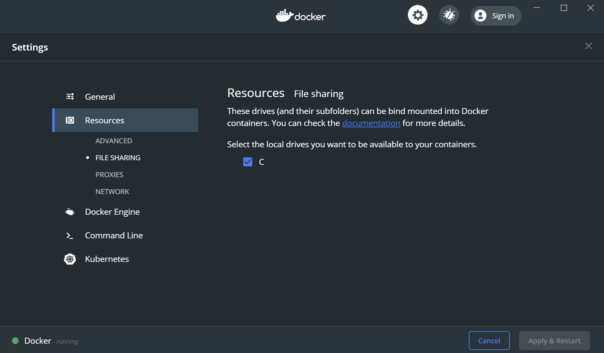

# Diving deeper into containers

## Introduction

This section we'll dive a little deeper into the containers we were running in the previous exercise.
We'll learn about connecting to running containers, about storing data in containers and how to persist data across the container lifetime.

## Exec into containers

Sometimes we need to connect into a running container, this allows us to inspect the container to see what is within it (i.e. the filesystem) and potentially the actual system itself (e.g. running processes)

Start the web application container if it's not already running by executing

```txt
docker start webapp1

```

if you deleted the container in the previous section you can create it again with:

```txt
docker run -d -p 8080:80  --name webapp1 shahiddev/k8s:1.0
```

confirm the container is running

```txt
docker ps
```

We can connect to running containers by using the **docker exec** command. This command allows to get into the running container (imagine RDP'ing into a VM)

```txt
docker exec -it webapp1 bash
```

This command will connect you to a bash prompt running inside the container. To do this we passed in a few additional parameters:

-it = interactive & ttyl (think of this as connect and pass my keyboard commands through to the container)

bash = the command to run inside the container (bash is the command line for Linux much like cmd.exe is for windows).

When you run the command you get a slightly different command prompt:

```txt
>docker exec -it webapp1 bash
root@b2758a95691a:/app#
```

This is the bash prompt inside the container. 
You can now explore this container as if it was a VM.

Here are a few useful Linux commands for navigating in the shell (with their Windows equivalents) to help you explore (**note** Linux is case sensitive so you ensure you are using the correct case for file/folder names):

ls = dir (to list files/folders)

clear = cls

cd .. = cd..

Tasks

1. Determine the Linux version
2. What is the username of the account in the container

When you want to exit this session you can simple type **exit**

### Exec into containers which exit after running

As we've seen we can exec into containers which are running but what if the container runs some code and exits immediately, how can we get a shell into this kind of container (the dotnet sample container we ran earlier in the exercises is an example of this).

If you want to inspect this container you cannot exec into the container because the container starts, executes the .net application and then exits so there is no container available. To overcome this we can the start action of the container in order to run a shell instead of the application defined when the container was built (for .net containers this would usually be `dotnet <app.dll>`)

The following command will run the container interactively (-it) and change the **entrypoint** so it runs bash instead of dotnet. This lets you take a look inside a container which ordinarily would exit immediately after it's completed the program.

```txt
docker run -it --rm --name hellodocker --entrypoint bash microsoft/dotnet-samples
```

This approach can be useful to help debug if your container isn't crashing/stopping immediately after starting.

## State inside containers

If you application is writing to the local file system this will create state inside the container. It's important to realise that state created inside the container may not be persisted if the container is removed and recreated.

Let's explore this by connecting back into the web application container

```txt
docker exec -it webapp1 bash
```

At he bash prompt let's create a new folder

```txt
mkdir test
```

Let's navigate to this folder and create a file

```txt
cd test
touch hello.txt

```

(touch = create a blank file)

We can confirm the file exists with a **ls** command:

We should see something similar to this

```txt
root@b2758a95691a:/app/test# ls
hello.txt
root@b2758a95691a:/app/test#
```

Now go ahead and exit from the container by typing **exit**

If we now start another instance of the container:

```txt
docker run -d -p 8081:80  --name webapp3 shahiddev/k8s:1.0
```

Connect into this container and you should notice that the folder and file you created aren't there.

```txt
docker exec -it webapp3 bash
ls
```

Let's clean up before we move on (ignore any errors if a particular container is not found/running)

```txt
docker rm webapp1 --force
docker rm webapp2 --force
docker rm webapp3 --force
```

This exercise modified the file system within the container, however this isn't usually what you want. As you saw when you run another instance of the container this state is no longer going to be there. Also trying to access this state or share it between other container is tricky/impossible.

To deal with this we have other options.

## Volumes

Docker allows us to create volumes which can be used by containers, these volumes are persisted on the host machine and can be mounted by multiple containers to share state.

Let's create a container that uses a volume (note there are 2 different syntax options `-v` or `--mount`. Although Docker encourage the use of `--mount` you may often see the `-v` syntax is examples in blog posts)

```txt
docker run -d -v myvol:/app/temp  --name webapp1 shahiddev/k8s:1.0
```

-v = volume
myvol = name of volume (created if not exists)

/app/temp = path to mount volume in container

The equivalent of this command using the `--mount` syntax is:

```txt
docker run -d --mount type=volume,source=myvol,target=/app/temp  --name webapp1 shahiddev/k8s:1.0
```

This command will run the web application container and mount (creating if needed) a volume called *myvol* to the /app/temp folder.

If you wanted to you could create the volume before hand and then use it exactly as we did above:

```txt
docker volume create myvol
```

Tasks:

1. Shell into the webapp1 container
2. Confirm you can see the volume mounted at /app/temp
3. Create a new file in this temp folder called *hello.txt*
4. Run a second instance of the container called **webapp2** and mount the same volume
5. Confirm you can see the hello.txt file
6. Create a new file called *hello2.txt*
7. Shell back into webapp1 and confirm you can see the hello2.txt file

### Clean up

Docker won't remove the volume even if no container is using it so let's clean up the containers and volume

```txt
docker rm webapp1 --force
docker rm webapp2 --force
docker volume rm myvol
```

>Tip: you can include `--rm` in your docker run command and Docker will automatically remove the container when it's stopped

## Bind mounts

In the previous section we saw how we can mount volumes that allow us to share state between containers, how about if we wanted to share state from the host machine (remember this is the machine that the container is running on)

### File sharing for WSL1
**Note: We don't need to do this drive sharing if we're using Docker with WSL2** if you're using WSL2 you won't see this menu option and you can skip this step.

First let's ensure Docker know's the drives we want to share.
In the system tray right-click on the Moby icon and select settings.

Ensure the shared drives is ticked for C:



### Mounting host folder into container
Once again you have a choice of using the `-v` or `--mount` syntax. This is where the `-v` syntax can look quite confusing so we'll use the `--mount` syntax as it's more readable and the recommended approach.

First let's create a new folder on your local c: drive and then mount that into the web application container (the host machine folder needs to exist before trying to mount it).

```txt
mkdir c:\host-folder
docker run -d --mount type=bind,source=c:\host-folder,target=/app/container-folder  --name webapp1 shahiddev/k8s:1.0
```

You can see this time we've specified the mount type to be `bind` and provided a path to a folder for the source.

Tasks

1. Shell into the webapp1 and create a file in the container-folder
2. Verify that the file is visible on your host machine
3. Do the reverse by creating a file in your host-folder and verifying it's visible in the container


### Additional exercises

(you may need to [refer to the docs](https://docs.docker.com/storage/) to help you here)

1. How do you mount a local folder which has spaces? Try it.
   
2. Mount a volume from your local drive as a read-only volume
   
3. Create a temporary volume using tmpfs mounts and show files are gone when container stops.
   
4. (Optional) Run an nginx container and map a local folder with an index html file so that browsing to the site displays your html file

>Note: When you use Visual Studio and add Docker support, it uses this "trick" of mounting the code folder into a container which allows changes to code to be quickly reflected in the container rather than having to perform a container build every time.

## Key takeaways

* Persisting state directly into the container is not recommended.
* Use volumes to share state between multiple containers (e.g. multiple instances of same image)
* Use Bind mounts to access host folders
* Use read-only mounts whenever you don't need to write to the mounted filesystem
* tmpfs mounts are preferable if you have transient data being generated in your container.
