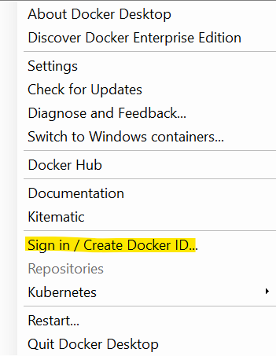

# Docker images

## Introduction

So far we've been running containers that were already in the registry (DockerHub), this section will explore how we go about creating our own container images, we'll tag them and eventually push them to a registry.

## Build your first container image

As you would have learnt already Docker images are made up of layers each of which builds upon the existing layers.

Let's start by creating a new dotnet console application

```cmd
mkdir src
cd src
dotnet new console -n hello-docker
cd hello-docker
```

**This example uses .NET Core 3.1 - if you are not using .NET Core 3.1 you may need to amend the version of the docker images being used. Typically you should be ok running newer SDK/runtime versions against older .NET Core versions**

We need to ensure our new .NET Core project is targeting the .NET Core 3.1 runtime (this is the long term release version)

Confirm the csproj is targetting .NET Core 3.1 by inspecting the hello-docker.csproj file and ensure the `<TargetFramework>` element is:

```xml
<TargetFramework>netcoreapp3.1</TargetFramework>
```

Save the csproj file and in the console window type

```cmd
dotnet run
```

This sequence of commands should create a new dotnet console application and run it resulting in something similar to this:

```txt
src\hello-docker>dotnet run
Hello World!
```

To "docker-ise" this we need to add a Docker file to the root of the project
By convention the Dockerfile is called `Dockerfile` with no extension.

Create a new file in the hello-docker folder called Dockerfile (ensure it has no extension)

Paste in the following to the Dockerfile and save it

```docker
FROM mcr.microsoft.com/dotnet/core/sdk:3.1 AS build-env
WORKDIR /app

# Copy csproj and restore as distinct layers
COPY *.csproj ./
RUN dotnet restore

# Copy everything else and build
COPY . ./
RUN dotnet publish -c Release -o out

# Build runtime image
FROM mcr.microsoft.com/dotnet/core/runtime:3.1
WORKDIR /app
COPY --from=build-env /app/out .
ENTRYPOINT ["dotnet", "hello-docker.dll"]
```

We can now build this image using the `docker build` command

```txt
docker build -t hello-docker .
```

This command builds the docker image tagging it with the name "hello-docker". If you Dockerfile wasn't called Dockerfile and wasn't in this folder you can provide a path to the Dockerfile you want to use.

We can now run this newly built container:

```txt
docker run --name=hellodocker --rm  hello-docker
```

We should see the following output

```cmd
>docker run --name=hellodocker --rm hello-docker
Hello World!
```

>Note: we used the --rm flag to tell Docker to remove the container once it exits.

Tasks
   
1. Create your own blank asp.net web application and *docker-ise* it (hint: you'll need to use a slightly different docker file)
2. (Optional) If you are familiar with another language - try creating a hello-word in that language and *docker-rise* it

## Tagging images

When we build containers we will often tag them, we can see examples of these tags by looking at the container images we have pulled recently.

```txt
docker images
```

We can see for example the hello-docker container we created earlier is tagged as *latest*

```txt
REPOSITORY                                                       TAG                                        IMAGE ID            CREATED             SIZE
hello-docker                                                     latest                                     c80dc980c490        3 hours ago         180MB
```

When you build an image you have the option of providing a tag, if you do not by default the Docker build will tag it as latest.
>Reminder: In production scenarios you should avoid referencing images without specifying a specific tag. This avoids issues where an updated tag in the registry is automatically deployed/updated in your environment without you realising!

It's common to create a specific tagged version and also update the latest tag to the current version of the application. You can re-tag any image once it's been created and also untag images.

Let's tag our hello-docker image to be a specific version

```txt
docker tag hello-docker hello-docker:1.0
```

Now check the docker images and you should see 2 hello-docker images, the latest and also the v1.0.

Tasks

1. Update your console application to display a different message and create an updated image. Confirm you can run both the original version and your new version
2. Create a 2.0 tagged image alongside your 1.0 and latest

## Pushing images

So far in this section we've created some images and tagged them. However it's unlikely you'll be using the images on the same machine that you used to build them. 

To allow container images to be accessible from other locations you need to push these images to a container registry. Registries can be either public or private, and there are a number of different options available. DockerHub is the most popular container registry around and a free account will allow you to have unlimited public repositories along with a single private repository.

Pushing images to the container registry is straightforward once you've authenticated.

### Signing in

If you haven't done so already please create an account on DockerHub and create your first docker repository (it can be public for these examples)

You can sign into DockerHub using the UI



And enter you details in the dialog that pops up

Alternatively you do the same using the command line:

```txt
docker login
```

We're now ready to push our image to this registry.
Before we do that however we need to ensure we've created the name correctly. The image name needs to be prefixed with our DockerHub repository name.

In my case this would be `shahiddev/hello-docker:tag` as I've created a repository called `hello-docker` in my DockerHub account `shahiddev`.

Let's re-tag the image

```txt
docker tag hello-docker:1.0 shahiddev/hello-docker:1.0
```

Now we can push this up to DockerHub (note pushing images does require a half decent internet connection although only new layers should be being pushed)

```txt
docker push shahiddev/hello-docker:1.0
```

The push may take a few minutes to complete.

Tasks

1. Delete your local copy of hello-docker:1.0 and then run the container to verify the container is pulled from the DockerHub (hint: you can delete local copies of images using the `docker rmi` command)

### Clean up

Remember to clean up any containers you ran as part of the additional tasks.

You can also remove images on your local machine if you want to save space. Take a look at how you can use filtering to remove selected images https://docs.docker.com/engine/reference/commandline/image_prune/#filtering

## Takeaways

* Docker images are comprised of layers which are cached and re-used.
* Each line of a Dockerfile creates a new layer
* Docker multi-stage builds allow you to use one image to perform the build and a second image to use as the base image for output. This approach lets you create a smaller runnable image without needing to contain all of the tools required to build the image.
* Docker tag command lets you change the tag and the image name if required e.g. to push to a registry
* Always specify a tag when using Docker images in production