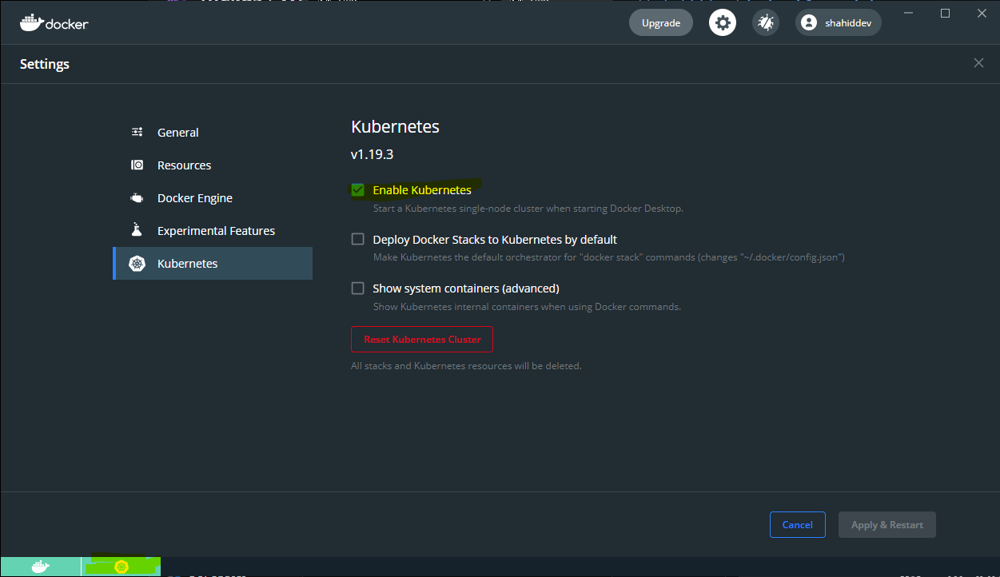

# Kubernetes basics

These exercises require `kubectl` to be installed and access to the Docker Kubenernetes cluster

Ensure that Kubernetes is enabled and the cluster is started




### Kubectl context

The docker tooling should have create a context for the kubectl command to work.
To confirm this you can check the current context:

```txt
kubectl config current-context
```

You should see `docker-for-desktop`

## Exploring the cluster and nodes

We can explore the cluster using a few commands

```txt
kubectl cluster-info
```
You should see some basic cluster-info

We can see what nodes we have in the cluster with

```txt
kubectl get nodes
```

If we want more information about a node we can `describe` it

```txt
kubectl describe node docker-for-desktop
```

We should see some detailed output for the node. Take a moment to inspect this output there is a lot of useful information in here

### node labels

Labels are key-value pairs which can be associated with many Kubernetes resources. They allow you to set metadata and also use that meta data in selectors to filter.

Label the node with a label

```txt
kubectl label node docker-for-desktop  envir1=workshop
```

Describe the node again and confirm you label is now visible

You can remove a label by calling

```txt
kubectl label node docker-for-desktop  envir1-
```

### Events

We can see events happening in the cluster using

```txt
kubectl get events
```

### Pods

Pods are the resource which encapsulates your container.
We can use the same pattern of verbs & nouns to list and describe pods.

To run a pod we can use

```txt
kubectl run hello-world --image=shahiddev/k8s:1.0  --port=80
```

This command is creating a deployment (well see more of that later) called "hello-world" using the image `shahiddev/k8s:1.0` which is on the DockerHub and it's exposing port 80 of the container

We can see the deployment we've just created by running

```txt
kubectl get deployments
```

Tasks

1. Using similar syntax used for the node list the pods that are running and get more information about them
2. Add a label to the pod called with the key *podnum* and value of *1*

We'll learn more about scaling later but for now lets scale up the number of pods

```txt
kubectl scale deployment/hello-world --replicas=3
```

This commands tells Kubernetes to scale the deployment called hello-world up to 3 replicas

Tasks

1. Confirm you can see 3 instances of the pod
2. Get the deployments - what's changed about the deployments?


### Filtering

We can use label selectors to filter against specific resources.

In this example we can use the label we added in one the previous tasks to filter the pods

```txt
kubectl get pods -l podnum=1
```

The `-l` is a label selector and here passing in the key and the expected value

You should see the list of pods is filtered down to a single pod - the one you created first

Tasks

1. Filter the pods to show you only those pods which don't have a label called *podnum* with a value of 1 (hint: you only need to add a single character to the label selector value podnum=1)

2. Add the *podnum* label to one of the other pods with a value **2**
3. Filter

We can use label selectors to filter a set of pods based on their labels

For example

```txt
kubectl get pods -l "podnum in (1, 2)"
```

This will list the pods which have the label podnum and value either 1 or 2

We can also filter pods to those that have a podnum label applied (irrespective of their values)

```txt
kubectl get pods -l podnum
```

Alternatively those pods that do not have a podnum label

```txt
kubectl get pods -l !podnum
```

You can find more examples of label selectors in the docs:

https://kubernetes.io/docs/concepts/overview/working-with-objects/labels/

### Container logs

We can inspect the logs of a container by using

```txt
kubectl logs <podname>
```

We can follow the logs by adding `-f` (ctrl + c breaks you out of the follow)

Tasks

1. Run a container of your choosing and inspect it
2. Bring up the logs from that container

Optional tasks

1. Create a deployment of your own image created in the Docker exercises (pick something like MongoDb) and and watch the logs for that container as it starts up.

### Clean up

We can delete the deployment using:

```txt
kubectl delete deployment/hello-world
```

> Note: you can reference deployments using the syntax `deployments/hello-world` or `deployments hello-world` or `deployment hello-world` they should all give the same result

## Takeaways

* Kubernetes CLI has a fairly consistent syntax for working with resources
* We can quickly run a container and scale it using imperative command line actions
* Labels allow for metadata to be added to many resources
* Label selectors allow us to filter resources based on the labels and/or their values